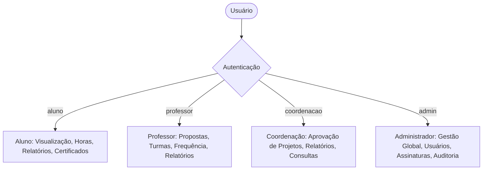
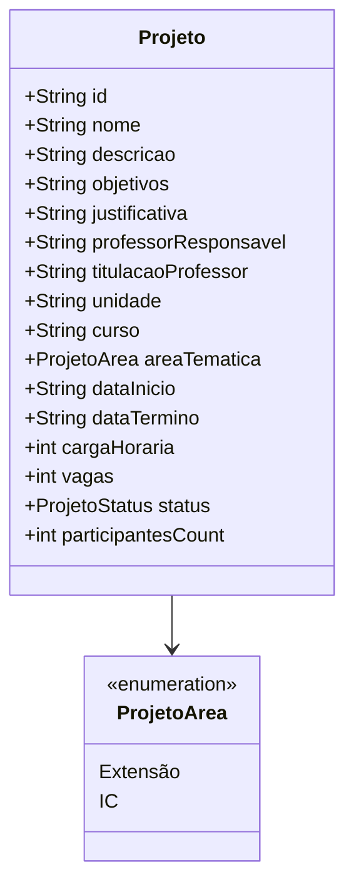
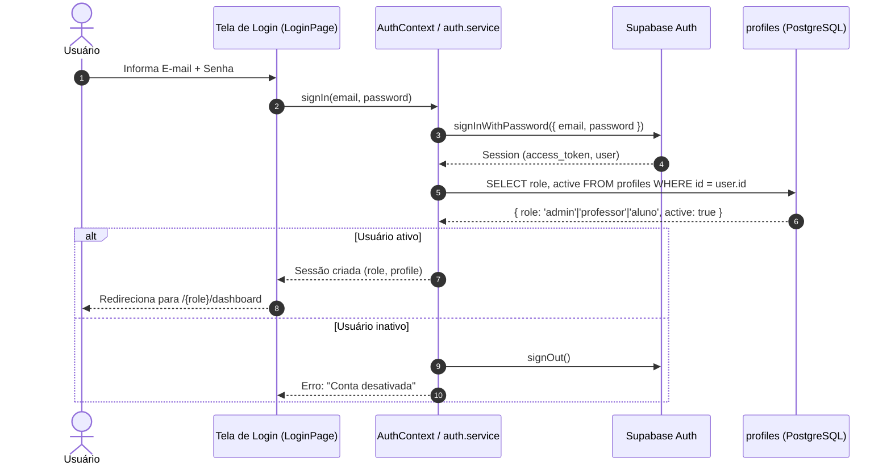
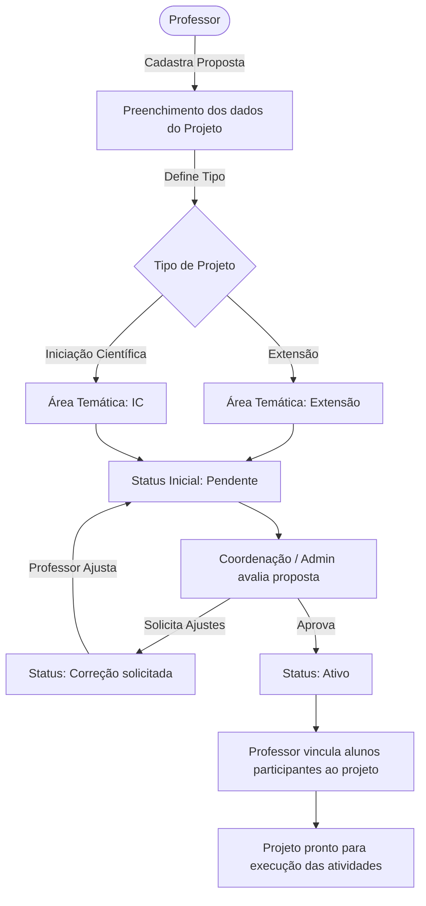
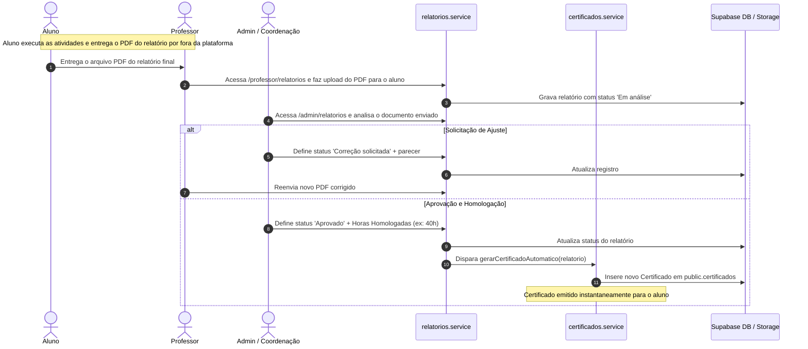
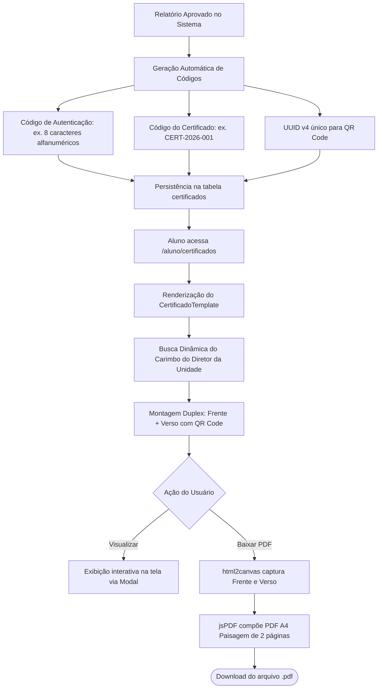
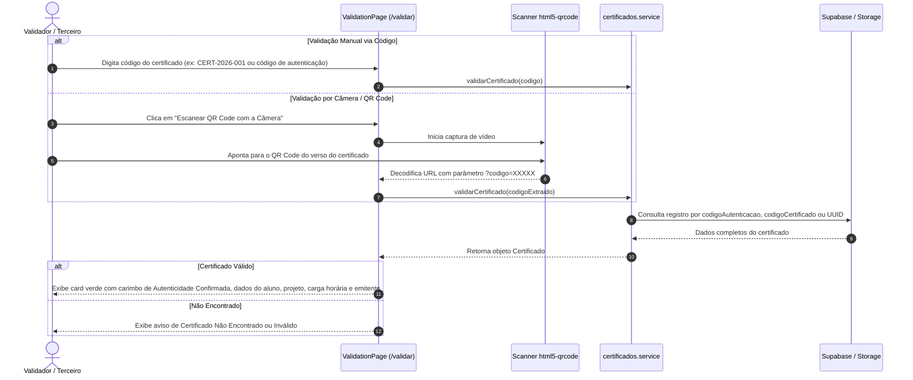
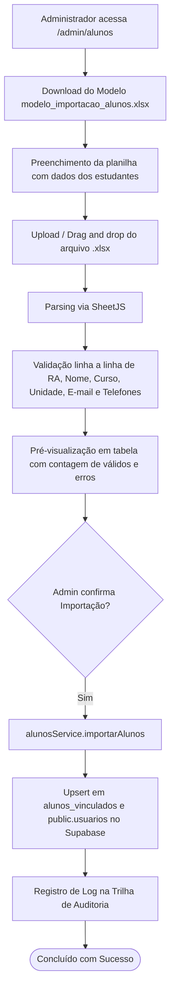

# 📚 Documentação Técnica Completa — Portal de Projetos UNINASSAU

Guia técnico, arquitetural, conceitual e operacional da plataforma **Portal de Projetos** (Extensão Universitária e Iniciação Científica — IC) da **UNINASSAU**.

---

## 📑 Sumário

1. [Visão Geral e Propósito do Sistema](#1-visão-geral-e-propósito-do-sistema)
2. [Stack Tecnológica e Dependências](#2-stack-tecnológica-e-dependências)
3. [Perfis de Acesso (RBAC) e Matriz de Permissões](#3-perfis-de-acesso-rbac-e-matriz-de-permissões)
4. [Tipos de Projetos e Regras de Negócio](#4-tipos-de-projetos-e-regras-de-negócio)
5. [Arquitetura de Software e Estrutura de Pastas](#5-arquitetura-de-software-e-estrutura-de-pastas)
6. [Mapeamento Completo de Rotas](#6-mapeamento-completo-de-rotas)
7. [Fluxos do Sistema (Diagramas de Sequência e Processo)](#7-fluxos-do-sistema)
   - 7.1. [Fluxo de Autenticação e Sessão](#71-fluxo-de-autenticação-e-sessão)
   - 7.2. [Fluxo do Ciclo de Vida do Projeto (Criação e Vinculação)](#72-fluxo-do-ciclo-de-vida-do-projeto)
   - 7.3. [Fluxo de Relatórios, Avaliação e Homologação de Horas](#73-fluxo-de-relatórios-avaliação-e-homologação-de-horas)
   - 7.4. [Fluxo de Emissão e Download de Certificados Digitais](#74-fluxo-de-emissão-e-download-de-certificados-digitais)
   - 7.5. [Fluxo de Validação Pública de Autenticidade (Código / QR Code / Câmera)](#75-fluxo-de-validação-pública-de-autenticidade)
   - 7.6. [Fluxo de Importação em Massa de Alunos (Planilha XLSX)](#76-fluxo-de-importação-em-massa-de-alunos)
8. [Modelo de Dados e Banco de Dados (PostgreSQL / Supabase)](#8-modelo-de-dados-e-banco-de-dados)
9. [Camada de Serviços (Services) e Fallback Híbrido](#9-camada-de-serviços-services-e-fallback-híbrido)
10. [Identidade Visual e Padrões de Interface](#10-identidade-visual-e-padrões-de-interface)
11. [Contas de Teste e Guia de Execução](#11-contas-de-teste-e-guia-de-execução)
12. [Importação em Massa de Projetos (XLSX)](#12-importação-em-massa-de-projetos-xlsx)

---

## 1. Visão Geral e Propósito do Sistema

O **Portal de Projetos UNINASSAU** é uma solução corporativa voltada para a gestão integral do ciclo de vida de projetos acadêmicos nas modalidades de **Extensão Universitária** e **Iniciação Científica (IC)**.

A plataforma atende desde o cadastro e submissão da proposta pelo corpo docente, aprovação pela coordenação de curso, vinculação de alunos, entrega e avaliação de relatórios finais, até a geração automatizada de certificados digitais com assinatura dinâmica do diretor de campus e validação pública por QR Code.

---

## 2. Stack Tecnológica e Dependências

| Camada / Função | Tecnologia | Descrição |
|---|---|---|
| **Core Frontend** | React 19 + TypeScript | Interface reativa orientada a componentes com tipagem estrita |
| **Build & Dev Server** | Vite 6 | Empacotador rápido com Hot Module Replacement (HMR) |
| **Roteamento** | React Router DOM v7 | Gestão declarativa de rotas e proteção por Guard (`PrivateRoute`) |
| **Estilização** | Tailwind CSS v4 + Vanilla CSS | Design system personalizado com cores nobres (Deep Navy, Dourado e Cyan) |
| **Formulários & Validação** | React Hook Form + Zod | Validação declarativa e performática com tipagem inferida |
| **Visualização de Dados** | Recharts 3 | Gráficos de evolução de carga horária e métricas |
| **Geração de Documentos** | jsPDF + html2canvas | Renderização visual e exportação em formato PDF duplex dos certificados |
| **Leitura de QR Code** | html5-qrcode | Validação de autenticidade por scanner de câmera em tempo real |
| **Manipulação de Planilhas** | SheetJS (xlsx) | Leitura e parsing de arquivos `.xlsx` na importação de alunos |
| **Ícones** | Lucide React | Conjunto moderno de ícones vetoriais |
| **Backend & Banco de Dados** | Supabase (PostgreSQL 15) | Banco relacional na nuvem com Storage para carimbos e assinaturas |

---

## 3. Perfis de Acesso (RBAC) e Matriz de Permissões

O sistema adota o padrão **Role-Based Access Control (RBAC)** estruturado em 4 papéis:



### Matriz Detalhada de Permissões

| Recurso / Módulo | Aluno | Professor | Coordenação | Administrador |
|---|:---:|:---:|:---:|:---:|
| Visualizar Projetos Vinculados | ✅ | ✅ (Próprios) | ✅ (Todos) | ✅ (Todos) |
| Criar Proposta de Projeto | ❌ | ✅ | ✅ | ✅ |
| Aprovar / Rejeitar Proposta de Projeto | ❌ | ❌ | ✅ | ✅ |
| Vincular Alunos a Projetos | ❌ | ✅ | ✅ | ✅ |
| Visualizar Histórico e Metas de Horas | ✅ | ❌ | ❌ | ❌ |
| Enviar Relatório PDF de Aluno | ❌ | ✅ | ❌ | ❌ |
| Avaliar Relatório e Homologar Horas | ❌ | ✅ (Próprios) | ✅ | ✅ |
| Emitir Certificados Avulsos | ❌ | ❌ | ❌ | ✅ |
| Visualizar e Baixar Certificados | ✅ (Próprios) | ❌ | ✅ | ✅ |
| Gerenciar Assinaturas Digitais / Carimbos | ❌ | ❌ | ❌ | ✅ |
| Importação em Massa de Alunos (XLSX) | ❌ | ❌ | ❌ | ✅ |
| Consulta Geral de Contatos de Alunos | ❌ | ✅ | ✅ | ✅ |
| Gestão de Unidades e Cursos | ❌ | ❌ | ❌ | ✅ |
| Gestão de Contas de Usuários | ❌ | ❌ | ❌ | ✅ |
| Auditoria e Logs de Operações | ❌ | ❌ | ❌ | ✅ |

---

## 4. Tipos de Projetos e Regras de Negócio

O sistema opera exclusivamente com **dois tipos de projetos acadêmicos**:



1. **Extensão Universitária (`Extensão`)**: Atividades e ações de intervenção comunitária com impacto social direto, transferindo conhecimento acadêmico à sociedade.
2. **Iniciação Científica (`IC`)**: Atividades de pesquisa acadêmica aplicada, produção científica, prototipagem ou artigos.

> ⚠️ **Regra Fundamental**: A separação entre **Extensão** e **IC** é refletida em abas exclusivas em todas as telas de listagem, gráficos de horas, relatórios e certificados.

---

## 5. Arquitetura de Software e Estrutura de Pastas

A aplicação segue o padrão **Feature-Driven Architecture (Modular por Domínio)**:

```
src/
├── app/                        # Bootstrap e Configurações Globais
│   ├── layouts/                # Shells e Layouts por perfil de acesso
│   │   ├── AdminLayout.tsx         # Layout Admin (sidebar e topbar com avatar)
│   │   ├── AlunoLayout.tsx         # Layout Aluno
│   │   ├── ProfessorLayout.tsx     # Layout Docente
│   │   ├── CoordLayout.tsx         # Layout Coordenação
│   │   ├── BaseDashboardLayout.tsx # Container unificado de navegação e logo circular
│   │   └── PublicLayout.tsx        # Container para rotas públicas (Login, Validador)
│   ├── providers/              # Providers do React Query e Contexts
│   └── router.tsx              # Roteador central com PrivateRoute e guards
│
├── components/                 # Componentes Visuais Reutilizáveis
│   └── ui/                     # Primitivas (Button, Modal, Input, Card, Alert, etc.)
│       ├── Modal.tsx               # Modal com scroll interno e responsividade
│       ├── PortalOverlay.tsx       # Renderização de modais via ReactDOM.createPortal
│       └── StatusBadge.tsx         # Badges coloridos padronizados por status
│
├── contexts/                   # Gerenciamento de Estado Global
│   └── AuthContext.tsx         # Sessão ativa, role, logout e persistência
│
├── features/                   # Módulos Funcionais Isolados
│   ├── auth/                   # Autenticação com abas para Aluno e Corpo Docente/Admin
│   ├── certificados/           # Emissão, renderização dupla, download em PDF e horas
│   ├── dashboard/              # Telas iniciais analíticas por papel
│   ├── projetos/               # Criação, listagem e aprovação de propostas
│   ├── relatorios/             # Envio de PDF pelo professor e avaliação de horas
│   ├── usuarios/               # Cadastro em massa (XLSX), diretório de contatos, unidades e cursos
│   └── validacao/              # Consulta pública de autenticidade (código e câmera QR)
│
├── lib/                        # Infraestrutura e Conexões
│   ├── storage.ts              # Preferências visuais (tema, sidebar) via localStorage
│   └── supabase.ts             # Cliente Supabase configurável
│
├── services/                   # Camada de Integração de Dados (Data Access Layer)
│   ├── alunos.service.ts       # Gestão de alunos, turmas e vínculos
│   ├── auditoria.service.ts    # Registro de logs de auditoria
│   ├── auth.service.ts         # Autenticação e credenciais
│   ├── certificados.service.ts # Emissão e validação de certificados
│   ├── projetos.service.ts     # CRUD de projetos e alteração de status
│   ├── relatorios.service.ts   # Submissão de relatórios e homologação de horas
│   ├── unidades.service.ts     # Unidades e cursos
│   └── usuarios.service.ts     # Usuários e assinaturas digitais
│
└── types/                      # Definições de Tipos TypeScript e Enums
    └── index.ts                # Interfaces de domínio (Projeto, Aluno, Certificado, etc.)
```

---

## 6. Mapeamento Completo de Rotas

### 🌐 Rotas Públicas
| Rota | Componente | Descrição |
|---|---|---|
| `/` | `LoginPage` | Autenticação para Alunos (RA + 6 dígitos CPF) e Staff (E-mail + Senha) |
| `/validar` | `ValidationPage` | Consulta pública de certificados (por código, hash ou QR Code) |
| `/extensao/validar` | Redirecionamento | Redireciona para `/validar` por compatibilidade |

### 🎓 Rotas do Aluno (`role: aluno`)
| Rota | Componente | Descrição |
|---|---|---|
| `/aluno/dashboard` | `AlunoDashboard` | Visão geral dos projetos ativos e horas acumuladas |
| `/aluno/projetos` | `AlunoProjetos` | Projetos em que o estudante está matriculado |
| `/aluno/relatorios` | `AlunoRelatorios` | Histórico dos relatórios e status de homologação |
| `/aluno/certificados` | `AlunoCertificados` | Visualização e download de certificados em PDF |
| `/aluno/horas` | `AlunoHoras` | Progresso contra a meta e gráfico de evolução mensal |
| `/aluno/historico` | `AlunoHistorico` | Linha do tempo das atividades completadas |

### 👨‍🏫 Rotas do Professor (`role: professor`)
| Rota | Componente | Descrição |
|---|---|---|
| `/professor/dashboard` | `ProfessorDashboard` | Painel docente com métricas de projetos e alunos |
| `/professor/projetos` | `ProfessorProjetos` | Meus projetos, criação de propostas e vinculação de alunos |
| `/professor/relatorios` | `ProfessorRelatorios` | **Envio do PDF do relatório do aluno ao Admin** |
| `/professor/avaliacoes` | `ProfessorAvaliacoes` | Histórico de avaliações realizadas |
| `/professor/alunos` | `ProfessorAlunos` | Lista de alunos orientados |
| `/professor/consulta-alunos` | `ConsultaAlunos` | Busca no catálogo geral de contatos de estudantes |
| `/professor/frequencia` | `ProfessorFrequencia` | Lançamento de frequência e encontros |

### 🏛️ Rotas da Coordenação (`role: coordenacao`)
| Rota | Componente | Descrição |
|---|---|---|
| `/coordenacao/dashboard` | `CoordDashboard` | Métricas globais da coordenação de curso |
| `/coordenacao/projetos` | `AdminProjetos` | Catálogo de todos os projetos acadêmicos |
| `/coordenacao/aprovacao` | `CoordAprovacao` | Análise e aprovação de propostas submetidas |
| `/coordenacao/participantes` | `AdminParticipantes` | Gestão de discentes vinculados |
| `/coordenacao/consulta-alunos` | `ConsultaAlunos` | Busca de contatos (e-mail, telefones) |
| `/coordenacao/relatorios` | `ProfessorAvaliacoes` | Painel de relatórios |
| `/coordenacao/certificados` | `AdminCertificados` | Catálogo de certificados emitidos |

### ⚙️ Rotas do Administrador (`role: admin`)
| Rota | Componente | Descrição |
|---|---|---|
| `/admin/dashboard` | `AdminDashboard` | Painel de controle executivo |
| `/admin/usuarios` | `AdminUsuarios` | Gestão de acessos e contas de usuários |
| `/admin/alunos` | `AdminCadastroAlunos` | **Importação em lote de alunos via XLSX** e cadastro avulso |
| `/admin/consulta-alunos` | `ConsultaAlunos` | Diretório geral de contatos |
| `/admin/unidades` | `AdminUnidades` | Gestão dos campi da instituição |
| `/admin/cursos` | `AdminCursos` | Gestão dos cursos de graduação |
| `/admin/projetos` | `AdminProjetos` | Gerenciamento de projetos |
| `/admin/aprovacao` | `CoordAprovacao` | Aprovação administrativa de propostas |
| `/admin/participantes` | `AdminParticipantes` | Matrícula de participantes em projetos |
| `/admin/certificados` | `AdminCertificados` | Emissão de certificados avulsos e pré-visualização |
| `/admin/assinaturas` | `AdminAssinaturas` | Cadastro de carimbos/assinaturas dos diretores |
| `/admin/relatorios` | `ProfessorAvaliacoes` | **Avaliação e homologação de relatórios** |
| `/admin/auditoria` | `AdminAuditoria` | Trilha de auditoria e logs de segurança |
| `/admin/configuracoes` | `AdminConfiguracoes` | Configurações gerais do sistema |

---

## 7. Fluxos do Sistema

### 7.1. Fluxo de Autenticação e Sessão



---

### 7.2. Fluxo do Ciclo de Vida do Projeto



---

### 7.3. Fluxo de Relatórios, Avaliação e Homologação de Horas



---

### 7.4. Fluxo de Emissão e Download de Certificados Digitais



---

### 7.5. Fluxo de Validação Pública de Autenticidade



---

### 7.6. Fluxo de Importação em Massa de Alunos



---

## 8. Modelo de Dados e Banco de Dados

O banco de dados relacional é hospedado no **Supabase (PostgreSQL 15)** com **RLS (Row Level Security)** habilitado em todas as tabelas.

### Esquema Real do Supabase

| Tabela | RLS | Descrição |
|---|---|---|
| `profiles` | ✅ | Perfis de usuários (id, first_name, last_name, email, role, active, first_access_completed) |
| `projects` | ✅ | Projetos acadêmicos (id, professor_id, title, description, category, workload_hours, status, etc.) |
| `project_participants` | ✅ | Junção N:N projetos ↔ alunos (UNIQUE project_id, student_id) |
| `project_documents` | ✅ | Documentos comprobatórios (storage_path, original_name, mime_type, size_bytes) |
| `certificates` | ✅ | Certificados emitidos (public_code, validation_uuid, status, issued_at, etc.) |
| `audit_logs` | ✅ | Logs de auditoria (actor_id, action, entity_type, metadata) |
| `unidades` | ✅ | Campi da instituição |
| `cursos` | ✅ | Cursos de graduação |
| `assinaturas` | ✅ | Assinaturas digitais dos diretores |

### Enums

| Enum | Valores |
|---|---|
| `app_role` | `aluno`, `professor`, `admin` |
| `project_status` | `rascunho`, `enviado`, `correcao_solicitada`, `reenviado`, `aprovado`, `rejeitado` |
| `certificate_status` | `valido`, `revogado` |
| `document_type` | `comprovante`, `outro` |

### Diagrama de Relacionamentos

```
profiles (1) ──── (N) projects           [professor_id]
profiles (1) ──── (N) project_participants [student_id]
projects (1) ──── (N) project_participants [project_id]
projects (1) ──── (N) project_documents   [project_id]
projects (1) ──── (N) certificates        [project_id]
profiles (1) ──── (N) certificates        [student_id]
unidades (1) ──── (N) assinaturas         [unidade]
```

### Storage

| Bucket | Público | Tamanho Max | MIME Types | Propósito |
|---|---|---|---|---|
| `project-documents` | Não | 5MB | application/pdf | Comprovantes de projetos (versão ativa) |
| `certificate-assets` | Não | 10MB | image/png, image/jpeg, image/svg+xml | Logotipos, assinaturas, modelos |

### Edge Functions

| Função | JWT | Propósito |
|---|---|---|
| `create-managed-user` | Sim | Criar usuário gerenciado (admin/professor) |
| `first-access-request` | Não | Solicitar primeiro acesso (resposta genérica) |
| `validate-certificate` | Não | Validar certificado público (rate limited) |
| `import-students-batch` | Sim | Importar alunos em lote via XLSX (admin) |

---

## 9. Camada de Serviços e Persistência

Todos os serviços em `src/services/` operam **100% no Supabase**. Não há fallback para localStorage para dados operacionais.

### Persistência

| Dado | Armazenamento |
|---|---|
| Dados operacionais (projetos, certificados, usuários, etc.) | Supabase PostgreSQL |
| Documentos comprobatórios | Supabase Storage (bucket `project-documents`) |
| Assinaturas e carimbos | Supabase Storage (bucket `certificate-assets`) |
| Preferências visuais (tema, sidebar) | localStorage (apenas `ge_theme`, `ge_sidebar_collapsed`) |

### Resumo dos Serviços

1. **`auth.service.ts`**: Autenticação via Supabase Auth (e-mail + senha), recuperação de senha, primeiro acesso.
2. **`projetos.service.ts`**: CRUD de projetos, vinculação de alunos, envio para análise, correção e aprovação.
3. **`certificados.service.ts`**: Emissão automática via `approve_project`, validação pública, revogação.
4. **`alunos.service.ts`**: Cadastro de alunos via Edge Function `create-managed-user`, vinculação a projetos.
5. **`usuarios.service.ts`**: Gestão de usuários, assinaturas digitais e importação em lote de alunos via XLSX.
6. **`unidades.service.ts`**: Gerenciamento de campi e cursos.
7. **`auditoria.service.ts`**: Registro de logs de auditoria no Supabase.

---

## 10. Identidade Visual e Padrões de Interface

### Cores Institucionais e Gradients

- **Deep Navy**: `#001224`, `#001F3F`, `#002D54`
- **Gold Accent (Gradiente Nobre)**: `linear-gradient(135deg, #C9A84C, #F5DC7C, #E8C04A, #B8972D)`
- **Cyan / Azul de Ação**: `#0057B8`, `#06b6d4`, `#0284c7`
- **Parchment (Fundo do Certificado)**: `radial-gradient(ellipse at 50% 40%, #FEFCF6 0%, #FAF6F0 55%, #F4EDDF 100%)`

### Tratamento da Logo

- Arquivo: `public/logo.png`
- A logo oficial é renderizada de forma circular (`border-radius: 50%`) com sombra de profundidade (`box-shadow`), conferindo aspecto premium tanto no cabeçalho quanto no certificado e na barra lateral.

---

## 11. Procedimento do Primeiro Administrador

### Setup Inicial do Banco

O banco começa vazio. O primeiro administrador deve ser criado via **procedimento seguro**:

1. **Acessar o Supabase Dashboard** → SQL Editor
2. **Executar o seguinte SQL** (substitua o e-mail e nome):

```sql
-- Criar primeiro administrador
-- A senha será definida pelo usuário via fluxo de primeiro acesso
INSERT INTO auth.users (
  instance_id, id, aud, role, email, encrypted_password,
  email_confirmed_at, raw_user_meta_data, raw_app_meta_data,
  created_at, updated_at
) VALUES (
  '00000000-0000-0000-0000-000000000000',
  gen_random_uuid(),
  'authenticated',
  'authenticated',
  'SEU_EMAIL@instituicao.br',
  '', -- Senha vazia - será definida via primeiro acesso
  now(), -- Email confirmado administrativamente
  '{"nome": "Seu Nome", "role": "admin"}',
  '{"provider": "email", "providers": ["email"]}',
  now(), now()
) RETURNING id;
```

3. **Atualizar o profile** (substitua o `id` retornado):

```sql
UPDATE profiles SET
  role = 'admin',
  active = true,
  first_access_completed = false
WHERE id = 'ID_RETORNADO_NO_PASSO_ANTERIOR';
```

4. **Acessar a aplicação** → `/codigo-senha?purpose=first_access` → Informar e-mail + código + nova senha
5. **Verificar o e-mail** → Clicar no link para definir a senha
6. **Definir a senha** → Login com e-mail e nova senha

### Regras de Segurança

- **NUNCA** colocar senhas em migrations, seeds, código ou documentação
- **NUNCA** usar senhas padrão como `123456`
- O primeiro acesso sempre usa link seguro via e-mail
- Após criar o primeiro admin, a procedure de bootstrap deve ser removida

### Contas de Teste (Após Setup)

| Perfil | E-mail | Senha |
|---|---|---|
| **Administrador** | `admin@uninassau.br` | Definida via primeiro acesso |
| **Professor** | Criado pelo Admin via `/admin/usuarios` | Definido via primeiro acesso |
| **Aluno** | Criado pelo Professor ao adicionar ao projeto | Definido via primeiro acesso |

### Comandos de Terminal

```bash
# Instalação de dependências
npm install

# Executar servidor de desenvolvimento local
npm run dev

# Checagem de tipos TypeScript
npm run lint

# Build de produção
npm run build
```

---

## 12. Importação em Massa de Projetos (XLSX)

### 12.1 Visão Geral

O sistema permite importar múltiplos projetos不同的 com seus respectivos participantes a partir de um arquivo Excel (.xlsx). A funcionalidade está disponível para **admin** e **professor**.

### 12.2 Colunas Oficiais da Planilha

| # | Coluna | Tipo | Obrigatória | Observação |
|---|---|---|---|---|
| 1 | `nome_projeto` | Texto | Sim | Nome do projeto |
| 2 | `categoria` | Texto | Sim | "Extensão" ou "IC" (case-insensitive) |
| 3 | `descricao` | Texto | Sim | Descrição do projeto |
| 4 | `carga_horaria` | Número | Sim | Deve ser > 0 |
| 5 | `data_inicio` | Data | Sim | Formato ISO ou DD/MM/AAAA |
| 6 | `data_termino` | Data | Sim | Deve ser >= data_inicio |
| 7 | `nome_professor` | Texto | Sim | Nome completo do professor |
| 8 | `email_professor` | Texto | Sim | Email institucional |
| 9 | `nome_completo_aluno` | Texto | Sim | Nome completo (preservado integralmente) |
| 10 | `email_aluno` | Texto | Sim | Email do aluno |

### 12.3 Regras de Agrupamento

Linhas com mesma chave são agrupadas em **um único projeto**. A chave é composta por:
`nome_projeto + categoria + descricao + carga_horaria + data_inicio + data_termino + email_professor` (normalizados)

### 12.4 Permissões

| Role | Pode importar | Limites |
|---|---|---|
| **Admin** | Sim (qualquer professor) | Até 500 linhas |
| **Professor** | Sim (apenas próprios projetos) | Até 200 linhas |
| **Aluno** | Não | Bloqueado (403) |

### 12.5 Fluxo da Importação

1. **Upload** do arquivo `.xlsx` no frontend
2. **Parse** do XLSX → JSON (client-side)
3. **Validação** das 10 colunas obrigatórias
4. **Envio** do JSON para Edge Function `import-projects-batch`
5. **Processamento** server-side:
   - Validação redundante (server-side)
   - Criação de auth users (senha segura aleatória)
   - Upsert de profiles
   - Criação de projetos (status: rascunho)
   - Vinculação de students
6. **Retorno** com resultado detalhado por projeto

### 12.6 Códigos de Erro

| HTTP | Significado |
|---|---|
| 200 | Sucesso total |
| 207 | Sucesso parcial (alguns erros) |
| 400 | Validação falhou (array vazio, linhas inválidas) |
| 401 | JWT inválido ou ausente |
| 403 | Permissão insuficiente (aluno ou professor importando projeto de outro) |
| 500 | Erro interno do servidor |

### 12.7 Limites

| Limite | Valor |
|---|---|
| Máximo de linhas (admin) | 500 |
| Máximo de linhas (professor) | 200 |
| Tamanho máximo do arquivo | 5 MB |
| Timeout da Edge Function | 300s |

### 12.8 Idempotência

Reenviar o mesmo lote (mesmo `import_batch_id`) não duplica:
- **Projetos:** UNIQUE constraint parcial `idx_projects_import_batch_group` (import_batch_id + title + category + workload_hours + start_date + end_date)
- **Participantes:** UNIQUE constraint em `project_participants(project_id, student_id)`
- **Usuários:** UNIQUE constraint em `profiles.email`

### 12.9 Resultados de Teste (2026-08-24)

| Teste | Cenário | Resultado |
|---|---|---|
| 1 | Importação completa (admin, 5 projetos, 15 alunos) | ✅ |
| 2 | Idempotência (reenvio idêntico = todos skipped) | ✅ |
| 3 | Validação: email inválido, carga negativa, nome vazio | ✅ |
| 4 | Professor importa projeto de outro → 400 | ✅ |
| 5 | Professor importa projeto próprio → 200 | ✅ |
| 6 | Professor excede 200 linhas → 400 | ✅ |
| 7 | Admin excede 500 linhas → 400 | ✅ |
| 8 | Array vazio → 400 | ✅ |
| 9 | Sem autenticação → 401 | ✅ |
| 10 | JWT inválido → 401 | ✅ |

**10/10 testes passaram.** Ver detalhes em `SUPABASE_IMPLEMENTACAO.md` seção 22.

---

## 13. Limpeza de Dados de Teste (2026-08-25)

### 13.1 Usuário Preservado

- **Email:** `edgareda2015@gmail.com`
- **Profile:** role `admin`, active `true`
- **Auth:** UUID `95b59ac3-5905-4805-ba04-5c4716fb1688`

### 13.2 Dados Removidos

| Tabela | Registros removidos |
|--------|---------------------|
| auth.users | 22 (todos exceto o preservado) |
| profiles | 24 |
| projects | 6 |
| project_participants | 16 |
| audit_logs | 11 |

### 13.3 Frontend

- Nenhum mock, seed ou demo account encontrado
- Nenhum localStorage para dados operacionais
- Todos os dados vêm exclusivamente do Supabase

### 13.4 Verificações

- ✅ Apenas `edgareda2015@gmail.com` permanece
- ✅ Login funcional
- ✅ Painel admin funcional
- ✅ Nenhuma senha alterada
- ✅ Mocks não reaparecem
- ✅ Tabelas operacionais limpas
- ✅ RLS habilitada

---

## 14. Importação e Exportação de Alunos em Massa

### 14.1 Funcionalidades

| Funcionalidade | Descrição |
|----------------|-----------|
| Modelo XLSX | Download com 3 colunas (nome_completo, email, campus) + instruções |
| Importar Alunos | Upload XLSX → validação → preview → processamento via Edge Function |
| Exportar Alunos | Gera XLSX com dados reais do banco (nome, email, campus, situação, primeiro acesso, data) |
| Histórico | Lista de importações realizadas com detalhes |
| Cadastrar Usuário | Formulário individual com role (aluno/professor/admin) e campus |

### 14.2 Edge Functions

| Função | Versão | JWT | Descrição |
|--------|--------|-----|-----------|
| `import-students-batch` | v3 | Sim | Importação em lote com código sem expiração |
| `create-managed-user` | v3 | Sim | Cadastro individual com código de primeiro acesso |

### 14.3 Validações

**Importação (client + server):**
- Arquivo .xlsx
- Colunas obrigatórias: nome_completo, email, campus
- Campus: GRACAS, CAXANGA, BOA_VIAGEM (acentos normalizados)
- Email válido e normalizado
- Duplicidade no arquivo
- Conflito com professor/admin
- Limite: 500 linhas

**Cadastro individual:**
- Nome completo obrigatório
- Email válido
- Campus válido
- Role: aluno, professor ou admin
- Bloqueio de duplicidade

### 14.4 Permissões

| Ação | Admin | Professor | Aluno |
|------|-------|-----------|-------|
| Importar alunos em massa | ✅ | ❌ | ❌ |
| Exportar todos os alunos | ✅ | ❌ | ❌ |
| Gerar códigos de redefinição | ✅ | ❌ | ❌ |
| Cadastrar aluno em projeto próprio | ✅ | ✅ | ❌ |
| Cadastrar professor/admin | ✅ | ❌ | ❌ |

---

## 15. Códigos de Acesso Sem Expiração

### 15.1 Regra Definitiva

| Aspecto | Implementação |
|---------|---------------|
| Validade | Até primeiro uso (sem expiração temporal) |
| Unicidade | Um código ativo por usuário (gerar outro revoga todos anteriores) |
| Tentativas | Máximo 5 (bloqueado ao exceder) |
| Criptografia | Hash SHA-256 para validação, AES-256 para consulta admin |
| Propósitos | `first_access`, `password_reset`, `admin_restore` |

### 15.2 Migrações

| Migração | Descrição |
|----------|-----------|
| `021_alter_access_codes_no_expiry` | Adiciona `code_encrypted`, `blocked_at`, `admin_restore`; torna `expires_at` nullable |
| `022_create_password_reset_requests` | Nova tabela para rastrear solicitações de redefinição |
| `023_fix_rls_and_index_security` | RLS admin SELECT on access_codes, admin INSERT on audit_logs, unique partial index com `blocked_at` |
| `024_fix_rls_profiles_use_get_user_role` | Corrige policies profiles para usar `get_user_role()` em vez de JWT claims |
| `025_fix_rls_audit_logs_certificates_use_get_user_role` | Corrige policies audit_logs e certificates para usar `get_user_role()` |
| `026_add_profiles_search_for_professor` | Professor pode pesquisar alunos ativos para vinculação em projetos |
| `027_fix_admin_access_and_add_archived_at` | Corrige acesso do admin, adiciona archived_at, função get_user_access_status, search_users RPC |
| `028_remove_location_from_projects` | Remove coluna location (unidade/departamento) da tabela projects |
| `029_add_matricula_nome_completo_curso_to_profiles` | Adiciona colunas matricula, nome_completo, curso + índices únicos e parciais |
| `030_update_search_users_with_new_fields` | Atualiza search_users RPC para incluir matricula, nome_completo, curso na busca |

### 15.3.1 Arquivos Frontend Alterados (Etapa: Cadastro e Importação de Alunos)

| Arquivo | Alteração |
|---|---|
| `types/index.ts` | Profile, Usuario, AlunoParticipante, StudentImportRow, SupabaseProfileRow com matricula/nome_completo/curso |
| `usuarios.service.ts` | createUsuario, searchUsuarios, getAlunos, updateUser com novos campos |
| `AdminUsuarios.tsx` | Form cadastro com matricula/curso (aluno), tabela com colunas, busca por matrícula |
| `studentImportUtils.ts` | Template XLSX 5 colunas (matricula, nome_completo, curso, email, campus), parse, export |
| `ParticipantsStep.tsx` | Busca por matrícula/nome/email, form com nome_completo/matricula/curso, tabela com colunas |
| `DocumentStep.tsx` | Auto-save rascunho antes do upload, prop `onSaveDraft`, drag-and-drop sem projeto salvo |
| `ReviewStep.tsx` | Exibe nome/tamanho do PDF, informações de tipo e versão |
| `ProfessorProjetos.tsx` | Callback `onSaveDraft` no DocumentStep para auto-save + atualização de `editingId` |
| `certificados.repository.ts` | location→campus |
| `certificados.service.ts` | location→campus |

### 15.3 Edge Functions Atualizadas

| Função | Versão | Alterações |
|--------|--------|------------|
| `admin-generate-access-code` | v4 | Remove `expires_at`, adiciona `code_encrypted`, revoga todos os códigos anteriores (incluindo bloqueados) |
| `set-password-with-code` | v4 | Remove verificação de expiração, adiciona verificação de bloqueio |
| `create-managed-user` | v5 | Aceita matricula, nome_completo, curso; verifica matrícula existente; atualiza perfil existente |
| `import-students-batch` | v4 | Processa 5 colunas (matricula, nome_completo, curso, email, campus); distribuição por curso |

### 15.4 Segurança

- Código em texto plano: exibido apenas uma vez ao gerador
- Versão criptografada: admin pode consultar enquanto ativo
- Chave de criptografia: apenas em secrets das Edge Functions
- Bloqueio automático após 5 tentativas
- Rate limiting: 10 req / 15 min por IP, email e user_id
- Unique partial index com `blocked_at IS NULL`
- RLS: deny-all para anon/authenticated + admin SELECT para dashboard
- Nenhum `any` TypeScript no frontend
- Nenhum `service_role` no frontend
- Mensagens genéricas em erros (sem vazamento de detalhes internos)
