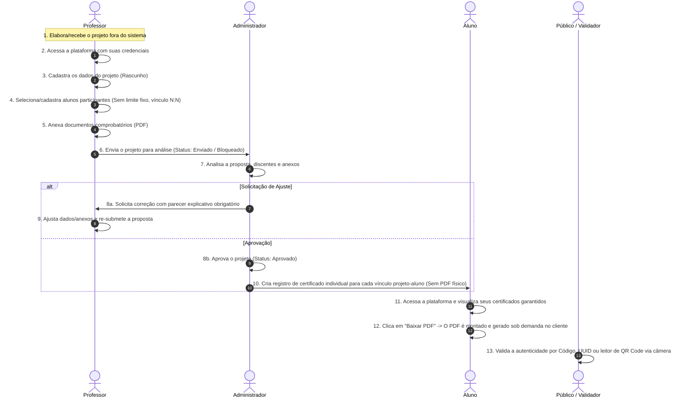

# 📋 FLUXO_SIMPLIFICADO.md — Plano de Análise e Arquitetura do Fluxo Simplificado

> **Status:** Diagnóstico e Especificação de Arquitetura (Sem alteração de código funcional nesta etapa).
> **Objetivo:** Mapear a simplificação do Portal de Projetos UNINASSAU para **3 perfis** (**Professor**, **Administrador**, **Aluno**), sob um modelo relacional N:N entre projetos e alunos, com emissão e montagem de PDF de certificados **sob demanda** (sem armazenamento prévio de PDFs físicos na aprovação).

---

## 🎯 1. Visão Geral do Fluxo Definitivo (13 Etapas)

O sistema operará sob o seguinte **fluxo linear de 13 etapas**:



---

## 🗺️ 2. Inventário e Classificação de Rotas e Páginas

### Inventário de Rotas

| Rota | Perfil | Classificação | Ação Recomendada | Raciocínio / Objetivo |
|---|---|---|---|---|
| `/` | Público | **Manter** | Manter | Tela de Login para Aluno, Professor e Administrador. |
| `/validar` | Público | **Manter** | Manter | Validador público oficial por Código, UUID e QR Code via câmera. |
| `/extensao/validar` | Público | **Manter** | Manter | Redirecionamento de compatibilidade para `/validar`. |
| `/aluno/dashboard` | Aluno | **Adaptar** | Simplificar | Exibir métricas de certificados liberados e projetos vinculados. |
| `/aluno/projetos` | Aluno | **Adaptar** | Manter | Lista de projetos acadêmicos nos quais a matrícula do aluno consta. |
| `/aluno/certificados` | Aluno | **Manter** | Manter | Tela para visualização e **download em PDF sob demanda**. |
| `/aluno/relatorios` | Aluno | **Remover** | Eliminar | Fluxo de envio de relatórios individuais descontinuado. |
| `/aluno/horas` | Aluno | **Remover** | Eliminar | Metas e contagem de horas acumuladas removidas. |
| `/aluno/historico` | Aluno | **Remover** | Eliminar | Linha do tempo acadêmica antiga removida. |
| `/professor/dashboard` | Professor | **Adaptar** | Simplificar | Resumo dos projetos sob responsabilidade do docente. |
| `/professor/projetos` | Professor | **Adaptar** | Reformular | **Núcleo docente**: cadastro, discentes, anexos em PDF, parecer e envio. |
| `/professor/relatorios` | Professor | **Remover** | Eliminar | Relatório separado eliminado (documentos viram anexos no projeto). |
| `/professor/avaliacoes` | Professor | **Remover** | Eliminar | Avaliação de relatórios individuais eliminada. |
| `/professor/alunos` | Professor | **Remover** | Eliminar | Gestão isolada de alunos orientados eliminada. |
| `/professor/frequencia` | Professor | **Remover** | Eliminar | Controle de frequência/encontros eliminado. |
| `/admin/dashboard` | Admin | **Adaptar** | Simplificar | Métricas de análise da instituição (pendentes, aprovados, unidades). |
| `/admin/projetos` | Admin | **Adaptar** | Reformular | **Fila de Análise**: leitura de anexos/alunos, aprovação ou parecer. |
| `/admin/certificados` | Admin | **Adaptar** | Simplificar | Consulta de registros de certificados e alternância (Válido/Revogado). |
| `/admin/usuarios` | Admin | **Manter** | Manter | Gestão de credenciais de administradores e professores. |
| `/admin/assinaturas` | Admin | **Manter** | Manter | Gestão de chancelas e assinaturas dos diretores de campus. |
| `/admin/cadastro-alunos`| Admin | **Remover** | Eliminar | Tela de upload em massa legada descontinuada. |
| `/coordenacao/*` | Coord | **Remover** | Eliminar | Perfil `coordenacao` descontinuado. |

---

## 🏛️ 3. Componentes Compartilhados Críticos

Os seguintes componentes são reutilizáveis e cruciais para o funcionamento do sistema, devendo ser mantidos e preservados:

| Componente | Localização | Papel / Uso no Fluxo Simplificado |
|---|---|---|
| `CertificadoTemplate` | `src/features/certificados/components/CertificadoTemplate.tsx` | Renderizador visual oficial do certificado (Frente + Verso + QR Code + Carimbo do Diretor). Essencial para a montagem em PDF sob demanda. |
| `BaseDashboardLayout` | `src/app/layouts/BaseDashboardLayout.tsx` | Shell responsivo do painel (sidebar, topbar, perfil do usuário). |
| `AdminLayout`, `ProfessorLayout`, `AlunoLayout` | `src/app/layouts/` | Wrappers de layout por perfil de acesso. |
| `Modal`, `PortalOverlay` | `src/components/ui/` | Modais acessíveis para cadastro de projetos, pareceres e detalhes. |
| `Button`, `Input`, `Card`, `Alert`, `StatusBadge`, `Breadcrumb` | `src/components/ui/` | Design system da aplicação. |
| `AuthContext` | `src/contexts/AuthContext.tsx` | Provedor de sessão e gestão de perfis (`admin`, `professor`, `aluno`). |

---

## 🗄️ 4. Modelo Proposto de Dados (Relacional N:N & Sob Demanda)

### Princípios da Modelagem

1. **Relacionamento N:N:** Um `Projeto` pode ter **N** alunos vinculados; um `Aluno` pode participar de **N** projetos. O projeto é cadastrado **uma única vez** no sistema.
2. **Geração de PDF Sob Demanda:** Na aprovação do projeto, o sistema **não gera nem armazena arquivos PDF**. É criado apenas um registro leve na entidade `Certificado` para cada vínculo projeto-aluno. O arquivo PDF é renderizado dinamicamente pelo cliente através do `CertificadoTemplate` + `html2canvas` + `jsPDF` no momento em que o aluno clica em **"Baixar PDF"**.

### Estrutura das Entidades

```typescript
// Status oficiais do projeto
export type ProjetoStatus = 'rascunho' | 'enviado' | 'correcao_solicitada' | 'aprovado' | 'rejeitado';

// Entidade Projeto
export interface Projeto {
  id: string; // Ex: "proj-1740381000000"
  nome: string;
  descricao: string;
  objetivos: string;
  justificativa?: string;
  professorId?: string;
  professorEmail?: string;
  professorResponsavel: string;
  titulacaoProfessor: string;
  unidade: string;
  curso: string;
  areaTematica: 'Extensão' | 'IC';
  dataInicio: string;
  dataTermino: string;
  cargaHoraria: number;
  vagas: number;
  status: ProjetoStatus;
  participantesCount: number;
  alunosParticipantes: AlunoParticipante[];
  documentosComprobatorios: DocumentoComprobatorio[];
  parecerAdmin?: string;
  dataCriacao?: string;
  dataAtualizacao?: string;
}

// Entidade Aluno Participante (Vínculo)
export interface AlunoParticipante {
  matricula: string;
  nome: string;
  curso: string;
  cpfLast6?: string;
  email?: string;
}

// Entidade Documento Comprobatório
export interface DocumentoComprobatorio {
  id: string;
  nome: string;
  tamanho: string;
  tipo: string;
  url?: string;
  dataUpload: string;
}

// Entidade Certificado (Registro leve sem PDF armazenado)
export interface Certificado {
  id: string; // Ex: "cert-1740381000000-2024001"
  projetoId: string;
  codigoAutenticacao: string; // Ex: "8F7A9B3C" (Único)
  codigoCertificado: string; // Ex: "CERT-2026-001" (Único)
  alunoNome: string;
  alunoMatricula: string;
  alunoCpfLast6: string;
  projetoNome: string;
  professorResponsavel: string;
  titulacaoProfessor: string;
  cargaHoraria: number;
  dataInicio: string;
  dataTermino: string;
  dataEmissao: string;
  unidade: string;
  situacao: 'Válido' | 'Revogado';
  uuid: string; // UUID v4 único
}
```

---

## 🧹 5. Arquivos e Recursos Descontinuados / A Serem Limpos

Para garantir o alinhamento com o fluxo simplificado, os seguintes recursos não fazem mais parte do escopo operacional:

1. **Perfil Coordenação (`coordenacao`):**
   - Removido do tipo `UserRole` e dos seletores de perfil.
2. **Módulo de Frequência e Encontros:**
   - Formulários e registros de presença em encontros foram eliminados.
3. **Módulo de Relatórios Individuais Separados:**
   - Envio e avaliação individual de relatórios por aluno foram substituídos pelos documentos comprobatórios anexados ao projeto pelo professor.
4. **Metas de Carga Horária e Gráficos:**
   - Contadores de metas acumuladas por aluno descontinuados.

---

## 🚨 6. Análise de Riscos de Exclusão

1. **Quebra de Renderização do Certificado:**
   - *Risco:* Se `CertificadoTemplate.tsx` ou `usuariosService.getAssinaturaByUnidade` forem removidos, o aluno não conseguirá visualizar nem baixar seu certificado.
   - *Mitigação:* Manter `CertificadoTemplate.tsx` em `src/features/certificados/components/` e preservar a tabela/serviço de assinaturas de diretores.
2. **Duplicação de Alunos no Mesmo Projeto:**
   - *Risco:* Um aluno ser incluído mais de uma vez em um mesmo projeto, gerando múltiplos certificados redundantes.
   - *Mitigação:* Validação estrita por `matricula` na adição de alunos no formulário docente e no serviço de salvamento.
3. **Invalidação de Certificados Revogados:**
   - *Risco:* Um certificado marcado como `'Revogado'` ser exibido como autêntico na consulta pública.
   - *Mitigação:* `ValidationPage.tsx` trata explicitamente `situacao === 'Revogado'`, exibindo um banner vermelho de revogação/invalidade.

---

## ⚡ 7. Plano de Implementação

1. **Camada de Serviços & Abstração (`src/services/` & `src/lib/`):**
   - Garantir 0 acessos diretos ao `localStorage` nas páginas de interface.
   - Centralizar tratamento de erros em `src/lib/errors.ts`.
   - Definir interfaces formais de repositório em `src/services/interfaces/repository.interface.ts`.
2. **Fluxo do Professor (`ProfessorProjetos.tsx`):**
   - Formulário completo para cadastro de rascunho, inserção de discentes (validação por matrícula) e anexo de comprovantes (PDF).
   - Exibição destacada do parecer do Admin e botão de reenvio.
3. **Fluxo do Administrador (`AdminProjetos.tsx`):**
   - Painel de análise com contadores de projetos enviados.
   - Modal com leitura de discentes e PDFs anexados.
   - Ações: Aprovar (gera 1 registro de certificado por aluno), Solicitar Correção (parecer obrigatório) ou Rejeitar (parecer obrigatório).
4. **Fluxo do Aluno (`AlunoCertificados.tsx`):**
   - Exibição dos certificados garantidos nos projetos aprovados.
   - Geração e montagem do PDF **sob demanda** ao clicar em "Baixar PDF".
5. **Validação Pública (`ValidationPage.tsx`):**
   - Consulta pública por Código, UUID ou QR Code via câmera. Exibição de alerta de revogação para certificados revogados.

---

## 🧪 8. Checklist para Testar os Três Perfis

### 👨‍🏫 Perfil Professor
- [ ] Consegue cadastrar um projeto em rascunho.
- [ ] Consegue adicionar alunos participantes e é impedido de inserir matrículas duplicadas.
- [ ] Consegue anexar documento comprobatório em PDF.
- [ ] Consegue submeter a proposta para análise (status altera para `enviado` e formulário fica bloqueado).
- [ ] Visualiza o parecer quando o Admin solicita correção, ajusta dados e re-submete a proposta.

### 👨‍💼 Perfil Administrador
- [ ] Visualiza a fila de projetos enviados em `/admin/projetos`.
- [ ] Abre os detalhes, lê os anexos e vê a lista de discentes participantes.
- [ ] Consegue solicitar correção informando parecer obrigatório.
- [ ] Consegue aprovar o projeto, gerando automaticamente os registros de certificado para todos os alunos participantes.

### 🎓 Perfil Aluno
- [ ] Acessa sua conta e visualiza os certificados liberados dos projetos aprovados dos quais participou.
- [ ] Clica em "Baixar PDF" e o documento (Frente + Verso) é montado e baixado no computador sob demanda.

### 🌐 Validador Público
- [ ] Acessa `/validar`, digita o código ou UUID e confirma a autenticidade.
- [ ] Escaneia o QR Code via câmera e valida instantaneamente.
- [ ] Ao consultar um certificado revogado, visualiza o banner vermelho de revogação/invalidade.

---

---

## 🔑 10. Credenciais Locais de Demonstração e Resultados de Validação

### Credenciais Locais (Modo DEV / Offline)

| Perfil | Identificador / Login | Senha / CPF | Painel Inicial |
|---|---|---|---|
| **Administrador** | `admin@uninassau.br` | `123456` | `/admin/dashboard` |
| **Professor** | `professor@uninassau.br` | `123456` | `/professor/dashboard` |
| **Aluno** | `2024001` (Matrícula) | `456789` (CPF 6 últimos) | `/aluno/dashboard` |

> ℹ️ As credenciais de teste são exibidas em uma caixa discreta com selo **MODO DEV** na própria interface de Login.

---

### 📂 Lista de Arquivos Removidos do Projeto

- `src/layouts/DashboardLayout.tsx`
- `src/components/ui/ConfirmDialog.tsx`
- `src/components/ui/Select.tsx`
- `src/features/usuarios/pages/AdminCadastroAlunos.tsx`
- `src/features/usuarios/pages/AdminCursos.tsx`
- `src/features/usuarios/pages/AdminUnidades.tsx`
- `src/features/usuarios/pages/AdminAuditoria.tsx`
- Referências ao perfil `coordenacao` em schemas (`usuarioSchema.ts`), breadcrumb (`Breadcrumb.tsx`) e seletores.

---

### 🗺️ Rotas Finais Definitivas

- `/` (Público - Login com abas ALUNO, DOCENTE e ADMIN)
- `/validar` (Público - Validador de Certificados)
- `/aluno/dashboard` (Aluno - Painel)
- `/aluno/projetos` (Aluno - Projetos Vinculados)
- `/aluno/certificados` (Aluno - Meus Certificados & Download PDF sob demanda)
- `/professor/dashboard` (Professor - Painel Docente)
- `/professor/projetos` (Professor - Meus Projetos, Cadastro e Submissão)
- `/admin/dashboard` (Admin - Painel Institucional)
- `/admin/projetos` (Admin - Fila de Análise e Decisão)
- `/admin/usuarios` (Admin - Gestão de Usuários)
- `/admin/certificados` (Admin - Certificados Emitidos e Revogação)
- `/admin/assinaturas` (Admin - Gestão de Assinaturas dos Diretores)

---

### 🧪 Resultados dos Testes de Qualidade

1. **Checagem de Tipagem TypeScript:** `npx tsc --noEmit` executado com **0 erros de compilação**.
2. **Build de Produção:** `npm run build` executado com **0 erros** (`dist/` gerado via Vite).
3. **Isolamento de Armazenamento:** Verificado que **nenhuma página UI realiza chamadas diretas ao `localStorage`**.

