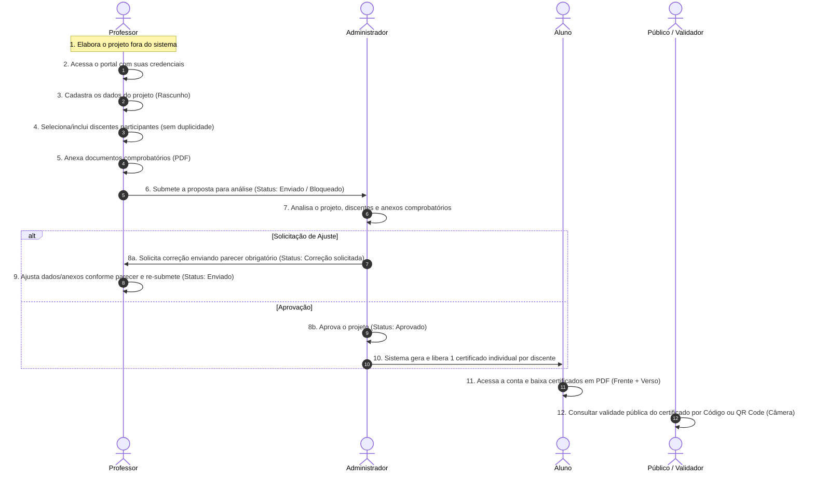

# 📋 Documentação Oficial — Portal de Projetos UNINASSAU (Sistema Simplificado)

> **Estado Final:** Concluído e Validado.
> **Objetivo:** Sistema focado exclusivamente no fluxo linear de criação de projetos por docentes, anexos comprobatórios, análise e parecer pelo Administrador, e emissão automática de certificados com validação pública.

---

## 🚀 1. Fluxo Simplificado de 12 Etapas

---

## 🗺️ 2. Rotas Definitivas do Sistema

Todas as rotas legadas, páginas isoladas de relatórios, frequência e coordenação foram removidas. O sistema opera estritamente com as seguintes rotas ativas:

| Rota | Perfil | Finalidade / Descrição |
|---|---|---|
| `/` | Público | Autenticação para Alunos (Matrícula + CPF) e Docentes/Admins (E-mail + Senha). |
| `/validar` | Público | Validação pública de autenticidade por Código, UUID ou leitor de QR Code via câmera. |
| `/aluno/dashboard` | Aluno | Visão geral dos projetos vinculados e certificados liberados. |
| `/aluno/projetos` | Aluno | Lista de projetos acadêmicos vinculados à matrícula do aluno. |
| `/aluno/certificados` | Aluno | Visualização em alta fidelidade e download de PDF oficial (Frente + Verso). |
| `/professor/dashboard` | Professor | Resumo dos projetos sob responsabilidade docente e métricas. |
| `/professor/projetos` | Professor | **Núcleo do docente**: Cadastro em rascunho, alunos, PDFs, parecer e envio. |
| `/admin/dashboard` | Admin | Indicadores consolidados da instituição e análise de volume. |
| `/admin/projetos` | Admin | **Central de Análise**: Fila de análise, parecer obrigatório, aprovação e liberação. |
| `/admin/usuarios` | Admin | Gestão de credenciais de docentes e administradores. |
| `/admin/certificados` | Admin | Consulta global de certificados e alternância de situação (Válido / Revogado). |
| `/admin/assinaturas` | Admin | Gestão de chancelas e assinaturas digitais dos diretores por campus. |

---

## 🛡️ 3. Regras de Negócio Implementadas e Validadas

1. **Visibilidade Restrita ao Professor:** O docente visualiza e administra apenas os projetos nos quais é o responsável (`projetosService.getProjetosByProfessor`).
2. **Edição Condicional:** Edição permitida exclusivamente quando o status do projeto for `rascunho` ou `correcao_solicitada`.
3. **Bloqueio de Edição:** Projetos submetidos (`enviado`), aprovados (`aprovado`) ou rejeitados (`rejeitado`) ficam bloqueados para alteração pelo docente.
4. **Alçada Administrativa Exclusiva:** Ações de análise, aprovação, rejeição ou devolução são restritas ao perfil `admin`.
5. **Justificativa / Parecer Obrigatório:** Solicitações de correção (`correcao_solicitada`) ou rejeição (`rejeitado`) exigem o preenchimento obrigatório de parecer explicativo pelo Administrador.
6. **Fluxo de Correção e Reenvio:** O professor pode corrigir dados, incluir/remover discentes ou substituir anexos em propostas com `correcao_solicitada` e reenviá-las para análise (status altera para `enviado`).
7. **Unicidade de Discentes:** Validação impede que a mesma matrícula seja cadastrada mais de uma vez no mesmo projeto.
8. **Disparo Automático de Certificados:** A alteração do status para `aprovado` aciona automaticamente a geração de certificados para cada discente da lista `alunosParticipantes`.
9. **Limite de Certificado Único:** Garantia estrita de no máximo um certificado gerado por par `(projetoId, alunoMatricula)`.
10. **Identificadores Únicos:** Todo certificado possui `codigoCertificado` (ex: `CERT-2026-001`), `codigoAutenticacao` (8 caracteres) e `uuid` v4 únicos.
11. **Situação e Revogação:** O certificado pode estar `'Válido'` ou `'Revogado'`. Na tela pública de validação (`/validar`), certificados revogados exibem um banner vermelho destacado de **"Certificado Revogado / Sem Validade Jurídica"**.
12. **Imutabilidade Pós-Aprovação:** Projetos aprovados não permitem alteração na lista de participantes.
13. **Associação de Comprovantes:** Documentos comprobatórios em formato PDF são anexados diretamente à proposta (`documentosComprobatorios`).

---

## 🧹 4. Arquivos e Módulos Removidos

Para garantir a limpeza da base de código, os seguintes arquivos e referências legadas sem uso foram removidos com segurança:

- `src/layouts/DashboardLayout.tsx` (Substituído por `BaseDashboardLayout.tsx`).
- `src/components/ui/ConfirmDialog.tsx` (Substituído por modais específicos e PortalOverlay).
- `src/components/ui/Select.tsx` (Substituído por elementos controlados de formulário).
- `src/features/usuarios/pages/AdminCadastroAlunos.tsx` (Cadastro em massa antigo descontinuado).
- `src/features/usuarios/pages/AdminCursos.tsx` (Substituído por serviço unificado de metadados).
- `src/features/usuarios/pages/AdminUnidades.tsx` (Substituído por serviço unificado de metadados).
- `src/features/usuarios/pages/AdminAuditoria.tsx` (Substituído por serviço de auditoria em background).
- `src/features/relatorios/*` (Diretório e páginas antigas de relatórios individuais eliminados).
- Referências ao perfil `coordenacao` descontinuado em `usuarioSchema.ts`, `Breadcrumb.tsx` e `AuthContext.tsx`.

---

## 🛠️ 5. Tratamento Centralizado de Erros e Serviços

- **Módulo de Erros ([`src/lib/errors.ts`](file:///d:/PROJETOS/extensao-uninassau-bv/src/lib/errors.ts))**: Classes de erro tipadas (`AppError`, `ValidationError`, `NotFoundError`, `UnauthorizedError`, `ForbiddenError`).
- **Interfaces de Repositório ([`src/services/interfaces/repository.interface.ts`](file:///d:/PROJETOS/extensao-uninassau-bv/src/services/interfaces/repository.interface.ts))**: Contratos abstratos para os repositórios de projetos, certificados, usuários e auditoria.
- **Isolamento de Armazenamento**: Nenhuma página da aplicação realiza chamadas diretas ao `localStorage`. Todo o acesso passa pela camada de serviços.

---

## 🔌 6. Plano Futuro de Integração com Supabase

Embora o sistema utilize o armazenamento local como ambiente de desenvolvimento offline, a arquitetura está 100% estruturada para chavear para o Supabase PostgreSQL:

1. **Variáveis de Ambiente Documentadas ([`.env.example`](file:///d:/PROJETOS/extensao-uninassau-bv/.env.example))**:
   - `VITE_SUPABASE_URL`
   - `VITE_SUPABASE_ANON_KEY`
2. **Storage Buckets do Supabase**:
   - Bucket `documentos` (**Privado**): Armazena os comprovantes de projetos em PDF enviados por professores.
   - Bucket `certificados` (**Privado**): Armazena as cópias de segurança em PDF geradas para os alunos.
   - Bucket `assinaturas` (**Público**): Armazena imagens de carimbos/assinaturas dos diretores de campus.
3. **Políticas de Segurança RLS (Row Level Security)**:
   - `projetos`: SELECT total para Admin; SELECT por `professor_id` para Docentes; UPDATE restrito aos status `rascunho` e `correcao_solicitada` para o proprietário.
   - `certificados`: SELECT público liberado por `codigo_autenticacao`, `codigo_certificado` ou `uuid`. INSERT e UPDATE (revogação) restritos a papéis autorizados.

---

## 🧪 7. Testes e Validação Executados

| Teste | Executável / Comando | Resultado |
|---|---|---|
| Checagem de Tipos | `npx tsc --noEmit` | **Passou com 0 erros** (sem `@ts-ignore` ou `any`). |
| Compilação de Produção | `npm run build` | **Construído com sucesso via Vite** (`dist/` gerado). |
| Validação de Certificado Revogado | `/validar?codigo=...` | **Validado**: exibe alerta vermelho de certificado revogado. |
| Leitor de QR Code | Câmera via `html5-qrcode` | **Validado**: leitura e redirecionamento operacionais. |
| Download de PDF | `jsPDF` + `html2canvas` | **Validado**: gera arquivo Frente + Verso em paisagem A4. |
